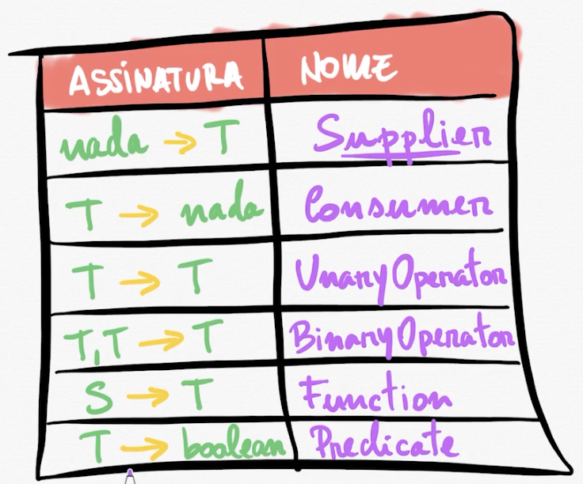
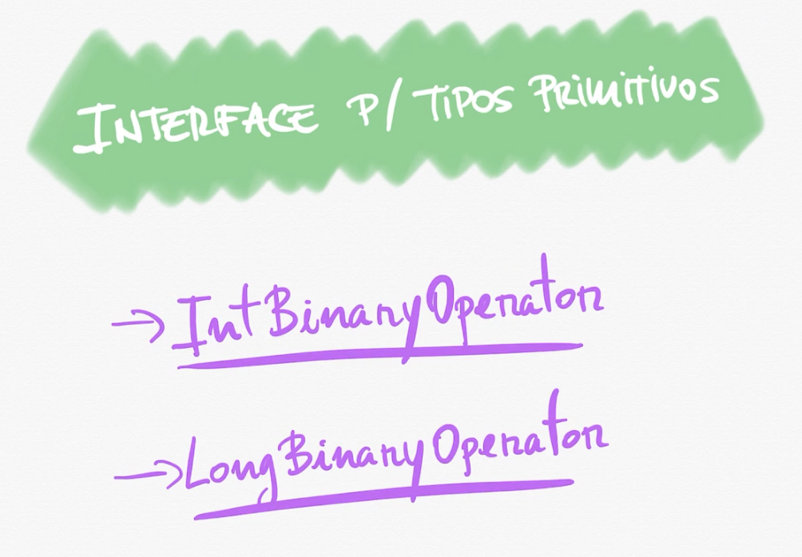

# Interfaces funcionais

- T, S sempre será uma classe.

> Exemplos de interfaces.

> Interfaces de tipos primitivos.

## Tipos:

- Predicate: recebe um parâmetro e retorna um boolean.
- Consumer: recebe um parâmetro e não retorna nada.
- Function: recebe um parâmetro e retorna um resultado.
- Supplier: não recebe parâmetro e retorna alguma coisa.
- Unary Operator: recebe um parâmetro e retorna alguma coisa do mesmo tipo do parâmetro.
- Binary Operator: recebe dois parâmetros e retorna alguma coisa, todos do mesmo tipo.
- BiFunction: recebe dois parâmetros e retorna alguma coisa, mas podem ser de tipos diferentes.
