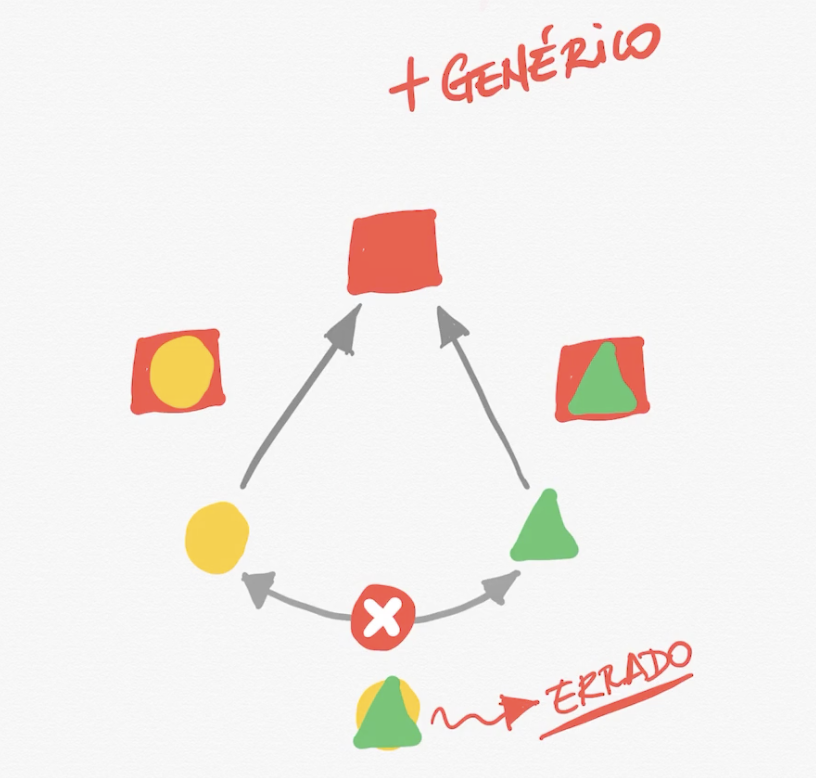

# Orientação a objetos

## Composição:
Uma aplicação é composta por classes que se relacionam e dependem entre si, para o funcionamento do produto final. A relação deve ser bem pensada para não termos um serviço muito ligado e difícil de fazer mudançãs e refatoração.

* toStRing() - retorna o objeto em java em uma string.

## Pilares da Orientação a Objetos

### Encapsulamento: 
Analizar o que faz sentido uma classe conhecer da outra, o que precisa estar público (visível para todo mundo) e do que precisa ser privado. Por exemplo, no carro temos acesso à marcha, ao volante (públicos), mas não ao motor nem ao funcionamento interno do carro (privado). Se tudo estiver sempre visível, a comunicação entre classes e métodos fica mais complexa. Com o encapsulamento a ideia é que o uso fique da forma mais simplificada possível.

#### Níveis de encapsulamento:
- public: nível menos restrito
- protected: visível no próprio pacote, na própria classe, e transmitido por herança para um outro pacote.
- package: default, visível dentro do mesmo pacote
- private: nível mais restrito

### Herança
Sempre será menos flexível que a composição. É usada a palavra `extends`.
É relação "... é um(a) ...", diferente de composição, que é a relação "... tem um(a) ...".

#### Exemplos:
- Civic é um carro. Carro tem um motor.
- Maçã é uma fruta. Casa tem uma cozinha.

- Importante: todo Civic é um carro, mas nem todo carro é um Civic. 

A classe filha (subclasse, mais específica) herda algumas características e comportamentos pré-definidos na classe pai (super classe, mais genérica).
Nem toda hierarquia gera herança, por exemplo, hierarquia militar.

- Hierarquia que gera herança: cachorro é um mamífero que é um animal.
- Hierarquia que não gera herança: capitão, tenente, sargento, cabo, soldado (um tenente não é um capitão).

Uma classe só pode herdar uma classe (pode ter apenas uma super classe), mas uma classe pode ser herdada por mais de uma classe (pode ter várias subclasses).
Podemos sobrescrever métodos específicos. Podemos inclusive chamar a implementação original e acrescentar coisas. Caso não exista nada sobrescrito, o método se comportará igual como na classe pai.

* decorator é um padrão de projeto que ajuda a substituir composição por herança.

#### Sobre construtores
`this(...)` - chamar o construtor da classe atual

`super(...)` - chamar o construtor da classe pai

O construtor da classe filha vai obrigatoriamente chamar o construtor da classe pai antes de construir o objeto.
Quando tornamos o construtor explícito na classe filha, devemos chamar o construtor da classe pai em pelo menos um dos construtores.

### Polimorfismo

#### Estático 
É a sobrecarga. Um método deve ter uma assinatura única, mas pode ter nome repetido, ou seja, são métodos com o mesmo nome mas com parâmetros diferentes. É como ter o mesmo método funcionando de multiplas formas. 
É escrito de forma estática no código.

#### Dinâmico
Podemos instanciar um tipo específico e atribuir a um tipo mais genérico, como por exemp lo `Carro carro = new Civic()`. O polimorfismo acontece aqui porque a partir do momento que atribuimos a variável `c` que é do tipo `Carro` a um `Civic`, podemos usar a mesma variável `c` a uma `Ferari`, por exemplo (outro tipo mais específico, como o `Civic`).  

> Polimorfismo.

### Abstração
Simplificar conceitos do mundo real para o software. Nem todas as classes no software terão um correspondente no mundo real (as vezes construímos conceitos para a organização de software ou pequenas diferenças específicas nos objetos), assim como em tudo no mundo real estará no software.

 